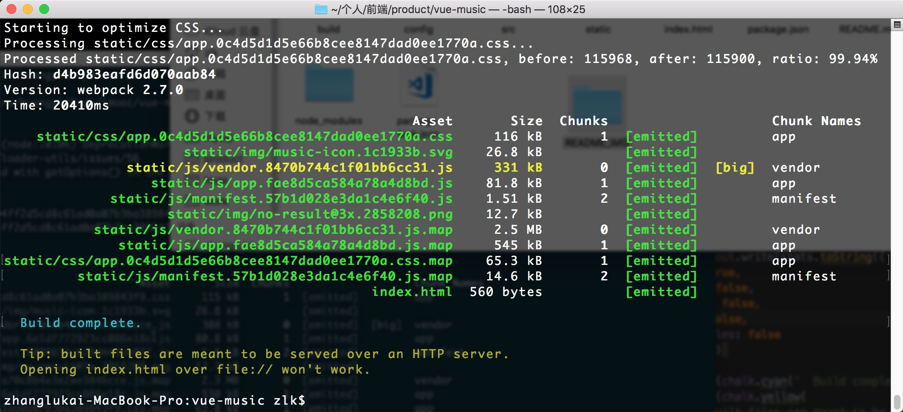
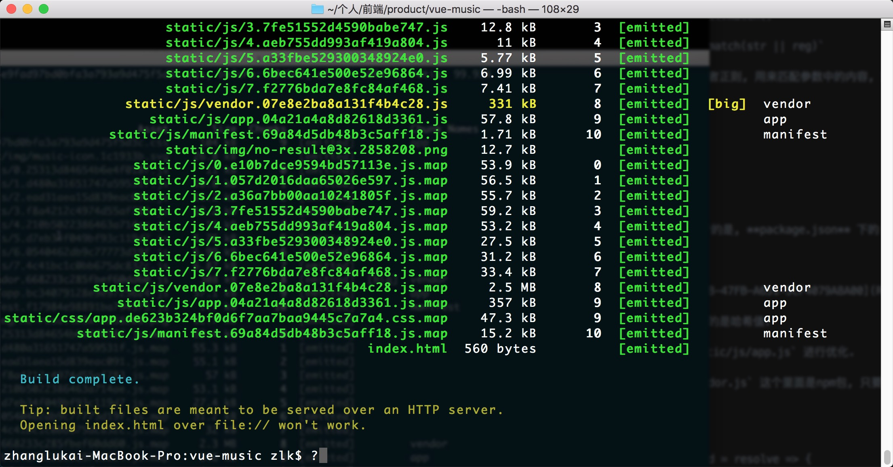

## 记得做

- 研究 node 开启服务器, 通过 axios 伪造代理获取请求

## 项目问题

this.$nextTick()

Element.getBoundingClientRect()

# vue-music

## 依赖

### -S

#### nbabel-runtime

对 ES 语法进行转译

#### fastclick

解决移动端 300ms 延迟

### -D

#### bable-polyfill

对 ES6 的API 进行转译

## 第三方插件

### good-storage

官方地址: https://github.com/ustbhuangyi/storage

对 sessionStorage 和 localStorage 的封装.

### fastclick

在main.js中配置

```javascript
import fastclick from 'fastclick'
fastclick.attach(document.body)
```

### jsonp

在发送请求之前, 先在 window 注册一个方法, 通过 script标签的src属性, 传输到服务器, 可以跨域抓取数据.

官方地址: https://github.com/webmodules/jsonp

```javascript
jsonp(url, opts, fn)
```

opts 是一个对象

- param: 函数名
- timeout: 最长等待时间

### better-scroll

官方文档: https://ustbhuangyi.github.io/better-scroll/doc/zh-hans/

### Vue-lazyload

官方地址: https://github.com/hilongjw/vue-lazyload

在main.js中配置

```javascript
import VueLazyLoad from 'vue-lazyload'
Vue.use(VueLazyLoad, {
  loading: require('common/image/default.png')
})
```

在模板中应用

```vue
<template>
  <div>
    <!-- 引用插件前 -->
	  
	  <!-- 引用插件后 -->
	  
  </div>
</template>
```

### create-keyframe-animation

官方地址: https://github.com/HenrikJoreteg/create-keyframe-animation

## 小技巧

### className

> 可以获取目标 DOM 元素的 class , 返回一个字符串, 可以添加 class .

```javascript
let box = document.getElementById('box')
console.log(box.className)
box.className = 'newClass'
console.log(box.className)
```

### JSONP有时会报500的错误

请求接口的时候, 请求头中的 **Host** 和 **Referer** 所引起的.

解决方法: 后端代理.

使用 **axios** .

这个库在前端环境下, 发送ajax请求, 在node环境下发送http请求.

在node下通过代理, 这样, 在前端就不能发送 **jsonp** 请求了, 要发送 **ajax** 请求.

### 案例出出现的大量的setTimeout, 20ms

浏览器会17ms刷新一次, 我们延迟执行, 可以优化性能, 避免获取不到dom对象.

## javascript方法

### stringObject.match()

`stringObject.match(str || reg)`

参数传入字符串或者正则, 用来匹配参数中的内容, 返回布尔值(不确定).

## 编译打包

执行命令

```bash
npm run build
```

> 这条命令, 执行的是, **package.json** 下的 **scripts** 中的 **build** . 对应 `node build/build.js` 这个文件.

打包完成后



文件格式名称前面的是哈希值.

我们可以对 `static/js/app.js` 进行优化.

`static/js/vendor.js` 这个里面是npm包, 只要不修改依赖包, 即便改了代码, 这个哈希值也是不变的.

### 路由懒加载

```javascript
const Recommend = resolve => {
  import('components/recommend/recommend').then(module => {
    resolve(module)
  })
}
```



> 打包完会多出很多文件, 但是首屏需要的 **app.js** 小了很多.

## 调试和抓包

### vConsole

官方文档: https://github.com/Tencent/vConsole/blob/dev/README_CN.md

> 微信前端团队出品, 直接改写了 **JS** 中 `console.log` 这个方法, 可以在移动端使用控制台.

### Charles

> Mac独有, 抓包工具.
>
> https的请求是抓不到的, 需要配置证书来抓.